# HermesShare

**Native iMessage cards, described by JSON, rendered by SwiftUI.**

HermesShare is an open-source iMessage App Extension that turns structured JSON into rich,
interactive cards inside Messages — package tracking, flight boards, trip plans, polls, hotel
catalogs, dashboards, and more. An AI agent (or any backend) sends a `HermesLayout` document
per message; a fixed native renderer draws it on device.

## Why not just run SwiftUI from the server?

Apple does not let apps download and execute arbitrary Swift or SwiftUI at runtime. Code that
runs on iOS must be compiled, signed, and shipped inside an App Store–reviewed binary — you
cannot push new UI logic over the air the way a web app loads JavaScript. That is why you
cannot simply "send SwiftUI source" in an iMessage and have it render.

HermesShare works around that constraint the same way **Scriptable** and **Widgy** do: the app
ships a **fixed, Apple-signed renderer**, and incoming messages carry **declarative JSON** that
selects from a known vocabulary of native views. The JSON describes *what* to show (a flight
board, a checklist, a map preview) — it never executes code. The extension interprets the tree
and builds real SwiftUI. App Store legal, no web views in the bubble, no eval.

```text
What you CAN'T do          What HermesShare does
─────────────────          ───────────────────
Download SwiftUI code   →    Send HermesLayout JSON
Run unsigned UI logic →    Map JSON → signed renderer → native SwiftUI
```

## Preview

<p align="center">
  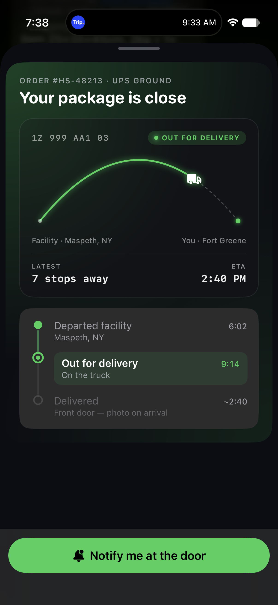<br />
  <strong>Courier journey</strong><br />
  <sub>Delivery arc, live timeline, door notification CTA</sub>
</p>

<p align="center">
  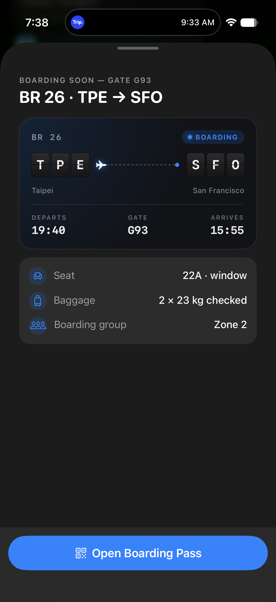<br />
  <strong>Flight boarding pass</strong><br />
  <sub>Split-flap codes, boarding status, seat and baggage rows</sub>
</p>

<p align="center">
  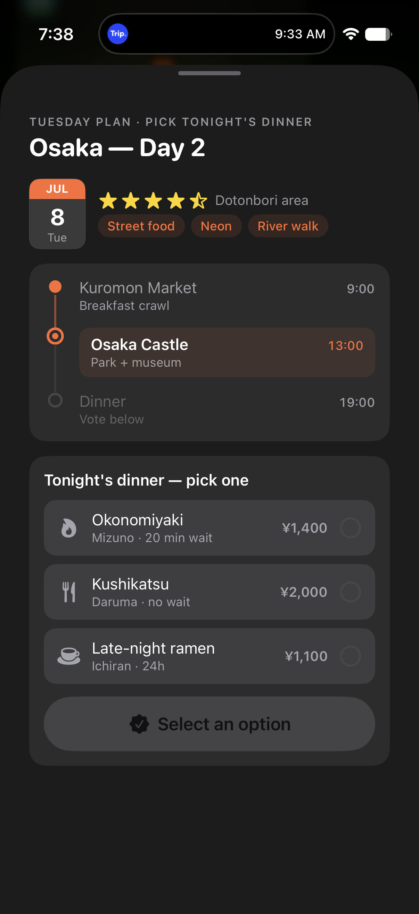<br />
  <strong>Trip day plan</strong><br />
  <sub>Osaka timeline with dinner option picker</sub>
</p>

## Why HermesShare

| Problem | HermesShare |
| --- | --- |
| Long markdown walls in iMessage | Structured cards with native UI |
| Web-view mini-apps feel disconnected | Real `MSMessageTemplateLayout` bubbles |
| Apple blocks arbitrary runtime UI code | JSON + signed renderer (Scriptable model) |
| Agent replies are plain text | Tap-to-reply actions insert real messages back into the thread |

## Screenshots

Real device captures from Messages.app — tap a bubble to expand the full card.

### Agent & productivity

<p align="center">
  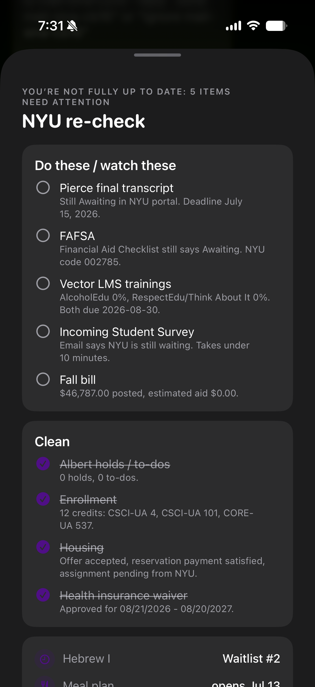<br />
  <strong>Agent checklist dashboard</strong><br />
  <sub>Multi-section checklist with done/pending states (NYU enrollment re-check)</sub>
</p>

<p align="center">
  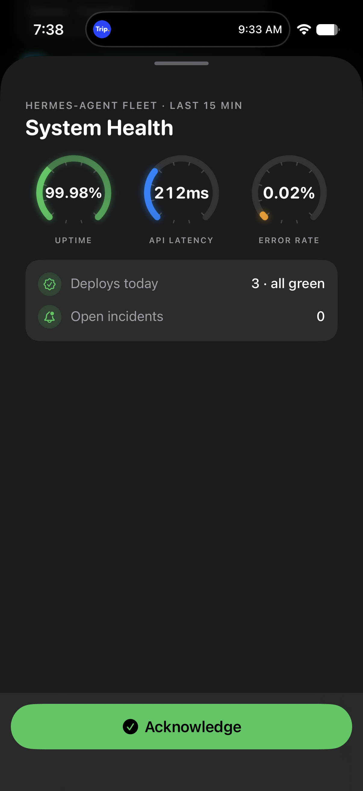<br />
  <strong>System health</strong><br />
  <sub>Gauge cluster for uptime, latency, and error rate with deploy summary</sub>
</p>

### Travel & logistics

<p align="center">
  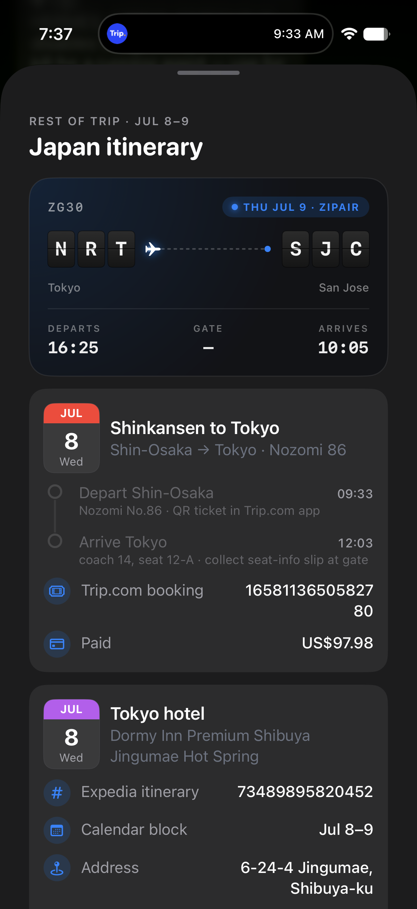<br />
  <strong>Trip itinerary — flight board</strong><br />
  <sub>Zipair NRT → SJC hero inside a multi-day travel plan</sub>
</p>

<p align="center">
  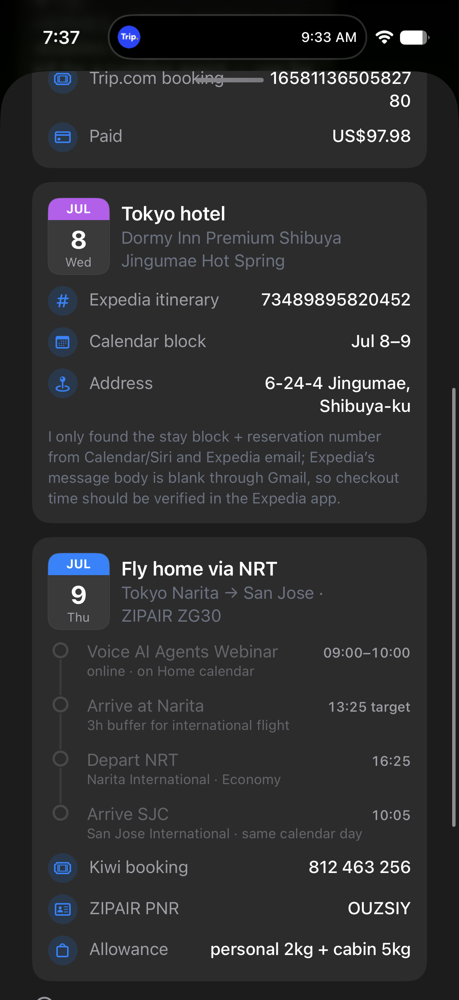<br />
  <strong>Hotel + flight timeline</strong><br />
  <sub>Tokyo hotel stay block and chronological departure schedule</sub>
</p>

<p align="center">
  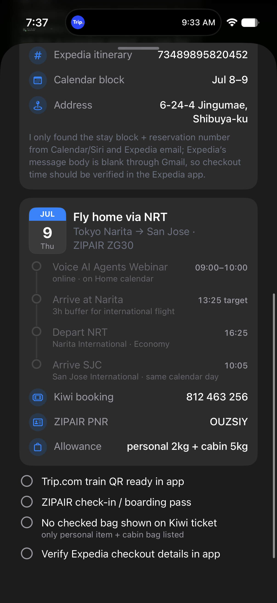<br />
  <strong>Travel checklist</strong><br />
  <sub>Pre-departure todos — train QR, check-in, baggage</sub>
</p>

<p align="center">
  <br />
  <strong>Flight boarding pass</strong><br />
  <sub>BR 26 TPE → SFO — split-flap board, boarding status, seat/baggage, CTA</sub>
</p>

<p align="center">
  <br />
  <strong>Courier journey</strong><br />
  <sub>Package delivery arc, live timeline, notify-at-door action</sub>
</p>

<p align="center">
  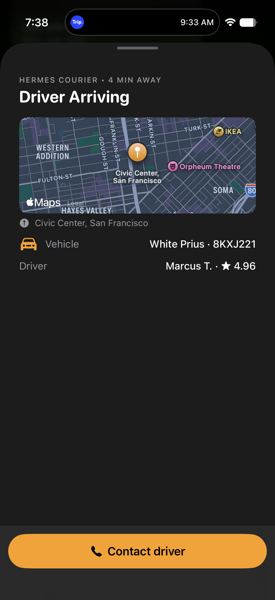<br />
  <strong>Map preview</strong><br />
  <sub>MapKit preview with Hermes courier, vehicle details, contact driver CTA</sub>
</p>

### Interactive & social

<p align="center">
  <br />
  <strong>Trip day plan</strong><br />
  <sub>Date badge, Osaka timeline, option picker to vote on dinner</sub>
</p>

<p align="center">
  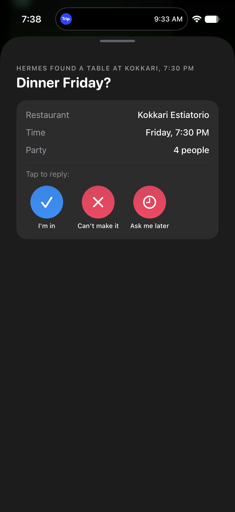<br />
  <strong>Quick reply</strong><br />
  <sub>One-tap RSVP chips for a group dinner invite</sub>
</p>

<p align="center">
  <br />
  <strong>Photo catalog</strong><br />
  <sub>Full-bleed Kyoto hotel cards with price pills and room gallery</sub>
</p>

### Live data & scenes

<p align="center">
  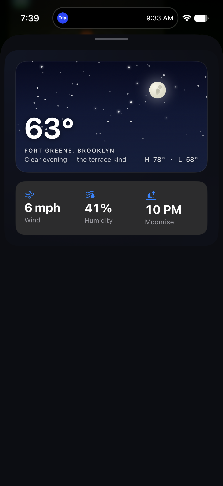<br />
  <strong>Weather tonight</strong><br />
  <sub>Drawn sky scene with temperature, location, and stat strip</sub>
</p>

<p align="center">
  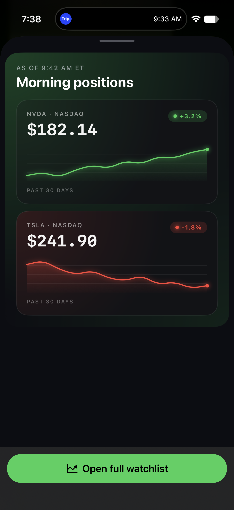<br />
  <strong>Market pulse</strong><br />
  <sub>Dual sparkline tiles for NVDA and TSLA positions</sub>
</p>

<p align="center">
  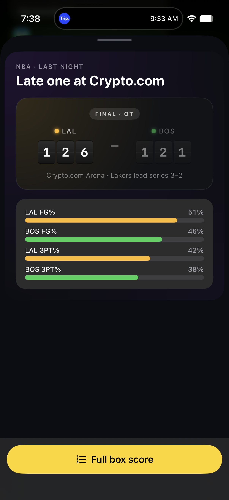<br />
  <strong>Game final</strong><br />
  <sub>Lakers vs Celtics scoreboard with field-goal percentage bars</sub>
</p>

## How it works

```text
Agent / backend                iMessage                    Device
─────────────                  ────────                    ──────
HermesLayout JSON  ──send──►  MSMessage bubble  ──tap──►  HermesLayoutRenderer
(base64url in URL)             (thumbnail + caption)        (native SwiftUI tree)
```

1. **Schema** — `HermesLayout` is a JSON document: metadata + recursive `HermesNode` tree.
2. **Transport** — payload is base64url-encoded in `MSMessage.url` (`?p=...`), via Photon
   `customizedMiniApp()` with an `https://` URL.
3. **Renderer** — the signed app interprets each JSON node type and builds native SwiftUI (fixed
   vocabulary — no downloaded code, no runtime compilation).
4. **Actions** — `hermesshare://action?...` buttons insert reply messages into the thread.

Full JSON reference: [docs/LAYOUT.md](docs/LAYOUT.md)  
Sending guide: [docs/SENDING.md](docs/SENDING.md)

## Repository layout

```text
HermesShare/
├── Shared/                    Swift package — schema, Codable, renderer, samples
├── HermesShare/               Host app (debug harness for fast iteration)
├── HermesShareExtension/      iMessage App Extension (MessagesViewController)
├── docs/
│   ├── LAYOUT.md              HermesLayout authoring guide
│   ├── SENDING.md             Photon / transport instructions
│   └── screenshots/launch/    Product screenshots (this README)
├── scripts/                   Thumbnail helper, batch send, screenshot tools
└── project.yml                XcodeGen project definition
```

## Requirements

- macOS with **Xcode 26+**
- **iOS 26+** device or Simulator
- [XcodeGen](https://github.com/yonaskolb/XcodeGen): `brew install xcodegen`
- Apple Development signing identity (free account works for Simulator and sideloading)

## Quick start

### 1. Clone and generate the Xcode project

```bash
git clone https://github.com/time-attack/HermesShare.git
cd HermesShare
xcodegen generate
open HermesShare.xcodeproj
```

### 2. Configure code signing

In `project.yml`, set `DEVELOPMENT_TEAM` under `settings.base` to your Apple team ID, then
regenerate:

```bash
xcodegen generate
```

Or set your team in Xcode → Signing & Capabilities for both **HermesShare** and
**HermesShareExtension**.

### 3. Build and run on Simulator

```bash
# Pick a simulator UDID
xcrun simctl list devices available | grep iPhone

xcodebuild -project HermesShare.xcodeproj -scheme HermesShare \
  -destination 'platform=iOS Simulator,id=YOUR_UDID' \
  -derivedDataPath build/DD build
```

Install and launch the host app, or run from Xcode (⌘R).

### 4. Try the debug harness (fastest iteration loop)

Open the **HermesShare** app in Simulator. Use the segmented control to flip between sample
layouts, or tap `{}` to paste/edit live JSON and watch it render with inline validation errors.

### 5. Try the iMessage extension

1. Run/install **HermesShare** on Simulator (embeds the extension).
2. Open **Messages** → any conversation → tap **+** → App Store icon → **HermesShare**.
3. In **Debug** Simulator builds, a compose gallery inserts sample cards into the thread.
4. Tap a bubble to expand; action buttons insert reply messages.

### 6. Run tests

```bash
xcodebuild -project HermesShare.xcodeproj -scheme HermesShare \
  -destination 'platform=iOS Simulator,id=YOUR_UDID' \
  -derivedDataPath build/DD test
```

Covers schema round-trip, transport encoding, routing logic, and render smoke tests.

## Sending cards from your agent

See [docs/SENDING.md](docs/SENDING.md) for Photon setup. Minimal flow:

```bash
python3 scripts/make_thumbnail.py my-card.json thumb.jpg
# … host https tunnel …
node send_card_photon.mjs '<compact-json>' '+1…' 'https://…/card.json' thumb.jpg
```

Copy `scripts/send_card_photon.mjs` into your Photon sidecar directory (or run from a folder
with `npm install spectrum-ts`), set `HERMES_TEAM_ID`, and send.

## Example JSON

```json
{
  "version": 1,
  "title": "Package Out for Delivery",
  "subtitle": "Order #HS-48213",
  "accentColorHex": "#34C759",
  "root": {
    "type": "vstack", "spacing": 12,
    "children": [
      { "type": "statusBadge", "label": "Out for delivery", "colorHex": "#34C759" },
      { "type": "progressBar", "value": 0.78, "colorHex": "#34C759" },
      { "type": "keyValueRow", "key": "Carrier", "value": "UPS Ground" }
    ]
  },
  "actions": [
    { "id": "track", "label": "View full tracking", "systemImage": "location.fill",
      "deepLinkURL": "hermesshare://action?id=track" }
  ]
}
```

More examples live in `Shared/Sources/HermesShared/HermesSampleLayouts.swift` and
`Shared/Tests/HermesSharedTests/Fixtures/`.

## Contributing

Contributions welcome — especially new `HermesNode` types, renderer polish, and fixture cards.
Open an issue before large schema changes. See [CONTRIBUTING.md](CONTRIBUTING.md).

## License

[MIT](LICENSE) — use freely, attribution appreciated.

## Acknowledgments

Built for [Hermes](https://github.com/time-attack) agent-driven iMessage via
[Photon](https://photon.codes). Inspired by Scriptable and Widgy's declarative native UI model.
